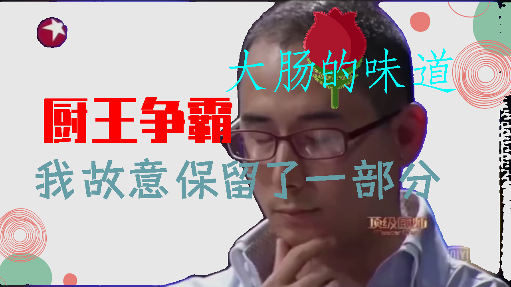

# Video Cover Generation

### Language-Guided Video Cover Generation with BSHM

This is my undergraduate thesis project.

#### Definition

video cover generation

input: a video and its heading (text)

output: video covers (images)

### Language-Guided Video Cover Synthesis with SAM
||||
|--|--|--|
||||"

## Acknowledgements
The projects are based on [Segment Anything](https://github.com/facebookresearch/segment-anything), [Text2Poster](https://github.com/chuhaojin/text2poster-icassp-22), [ChatGPT](https://openai.com/blog/chatgpt).
