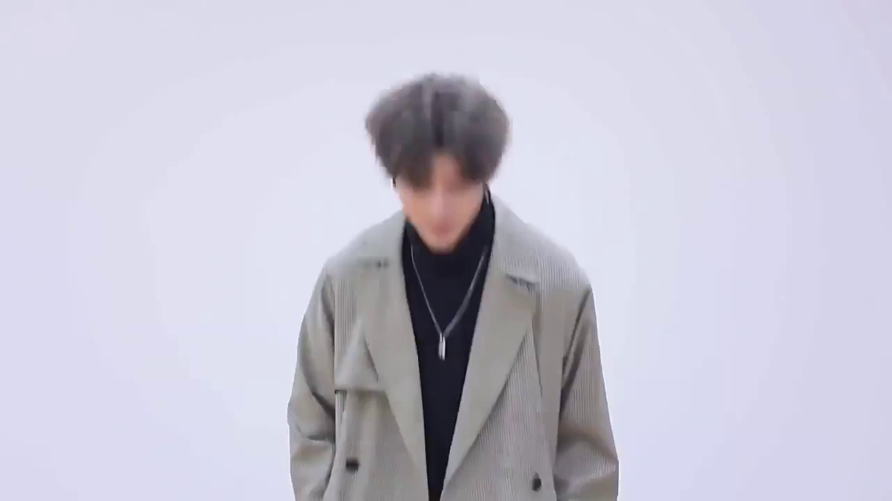
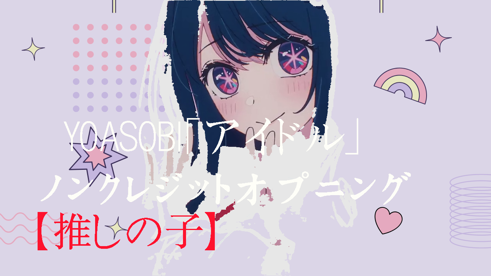
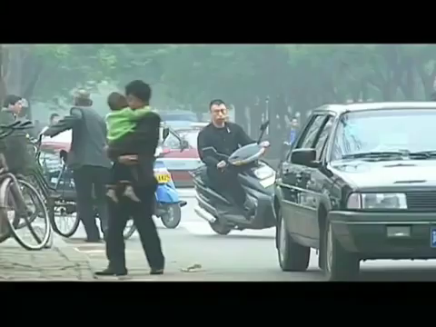

# Video Cover Generation

## Language-Guided Video Cover Generation with BSHM

This is my undergraduate thesis project.

### Definition

Generate video covers given video and heading.

- **input**: a video and its heading (text)

- **output**: video covers (images)

### Demo

|id|video|heading|video cover|
|--|--|--|--|
|1|
[jump.mp4](./example/demo_videos/jump.mp4)
|练习时长两年半的中国NBA形象大使教你打篮球||
|2|
[math.mp4](./example/demo_videos/math.mp4)
|It's me or the PS5? Robin Gan: DO MATH, PALY PS5!||
|3|
[cook.mp4](./example/demo_videos/cook.mp4)
|厨王争霸: 我故意保留了一部分大肠的味道||
|4|
[idol.mp4](./example/demo_videos/idol.mp4)
|【推しの子】ノンクレジットオープニング｜YOASOBI「アイドル」||
|5|
[shop.mp4](./example/demo_videos/shop.mp4)
|刘华强买瓜，贵不贵无所谓，关键是要保熟||

### Model

 

### Evaluation

FID is used to evaluate the results.

The eval data can be found in [./real_data](./real_data).

Comparison:

|FID|1|2|3|4|5|Avg|
|--|--|--|--|--|--|--|
|Random|429.75|441.90|393.83|409.67|467.78|428.59|
|First|455.37|491.33|465.60|511.42|580.75|500.89|
|LVCG|336.51|378.32|329.80|412.37|349.96|**361.39**|

Ablation:

|FID|1|2|3|4|5|Avg|
|--|--|--|--|--|--|--|
|**LVCG**|336.51|378.32|329.80|412.37|349.96|**361.39**|
|w/o emoji|383.38|334.85|359.17|372.02|358.69|361.62|
|w/o bg|445.52|388.78|399.64|367.96|454.24|411.23|
|w/o emoji + w/o bg|468.93|386.67|428.22|386.47|384.54|410.97|
|w/o text layout|450.38|409.58|423.88|387.40|415.42|417.33|

User Study:

| video ID | 1     | 2     | 3   | 4     | 5     | Avg   |
|----------|-------|-------|-----|-------|-------|-------|
| usability | 34.5% | 24.1% | 28% | 41.0% | 25.0% | 30.5% |

### Quick Start

1. Clone this repo.

2. You could see the [demo](./demo.ipynb) and use your own data to generate video covers.

## Language-Guided Video Cover Synthesis with SAM

Coming soooooooooooooooooon...

### Demo

|id|video|heading|video cover|
|--|--|--|--|
|1|
[jump.mp4](./example/demo_videos/jump.mp4)
|练习时长两年半的中国NBA形象大使教你打篮球||
|3|
[cook.mp4](./example/demo_videos/cook.mp4)
|厨王争霸: 我故意保留了一部分大肠的味道||

#### Dataset

Coming soooooooooooooooooon...

## Acknowledgements
The projects are based on [Text2Poster](https://github.com/chuhaojin/text2poster-icassp-22), [Segment Anything](https://github.com/facebookresearch/segment-anything),  [ChatGPT](https://openai.com/blog/chatgpt).
